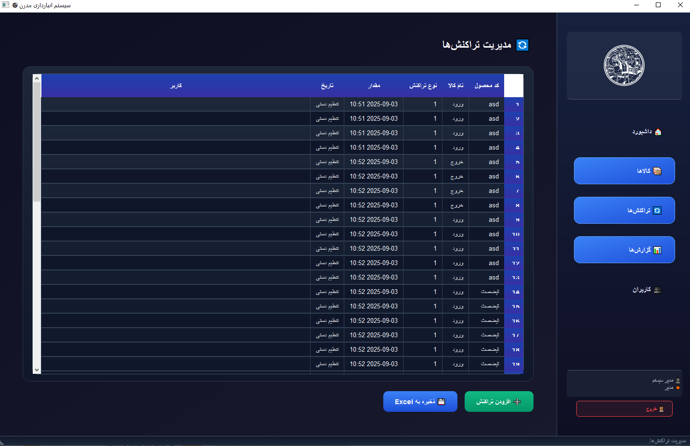

# نرم‌افزار حرفه‌ای مدیریت انبار (Warehouse Management)

یک نرم‌افزار دسکتاپ حرفه‌ای برای **مدیریت انبار** با رابط کاربری مینیمال و **کاملاً فارسی** ساخته شده با **Python و PyQt6**. این برنامه امکان مدیریت کالاها، ثبت تراکنش‌های ورود و خروج، تولید گزارش و نمودار و ذخیره داده‌ها در فایل‌های Excel را فراهم می‌کند.

---
<p align="center">


## ویژگی‌ها
</p>
--


- رابط کاربری **سیاه و سفید و مینیمال**  
- تمام متن‌ها و جدول‌ها **فارسی و راست‌چین (RTL)**  
- مدیریت کالاها: افزودن، ویرایش، حذف  
- ثبت تراکنش‌ها: ورود و خروج کالا  
- نمایش جدول کالاها و تراکنش‌ها با **QTableWidget / QTableView**  
- تولید گزارشات و نمودارهای موجودی با **matplotlib / plotly**  
- ذخیره و بارگذاری داده‌ها با **Excel (pandas)**:  
  - `products.xlsx` برای کالاها  
  - `transactions.xlsx` برای تراکنش‌ها  
  - `users.xlsx` برای کاربران  
- نوار کناری (Sidebar) برای ناوبری: داشبورد، کالاها، تراکنش‌ها، گزارش‌ها، کاربران  
- نوار وضعیت (Status Bar) در پایین پنجره  
- ساختار ماژولار برای توسعه آسان:  
  - `main.py`: اجرای برنامه  
  - `main_window.py`: رابط کاربری  
  - `models.py`: مدیریت داده‌ها در حافظه  
  - `utils.py`: توابع کمکی  

---

## پیش‌نیازها

- Python 3.10+  
- کتابخانه‌ها:  
```bash
pip install pyqt6 pandas matplotlib openpyxl


